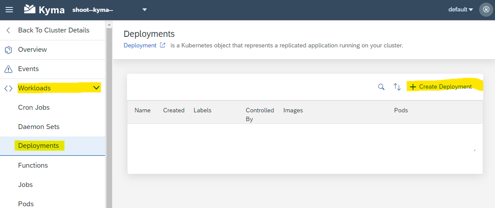
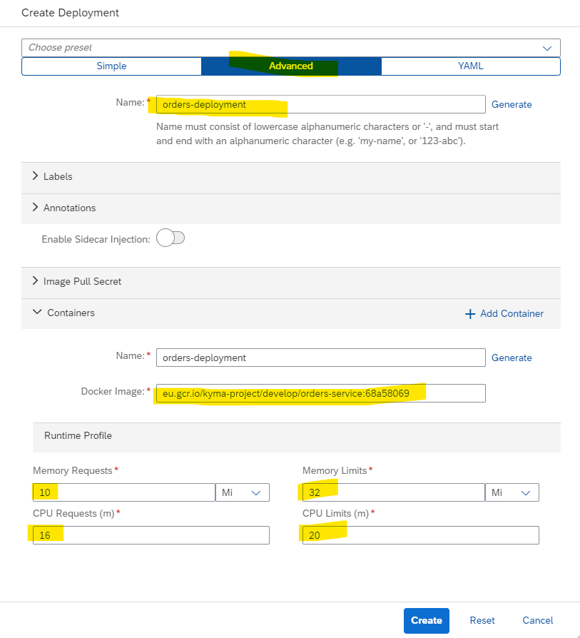
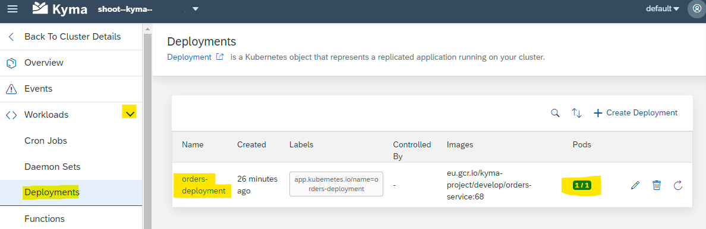
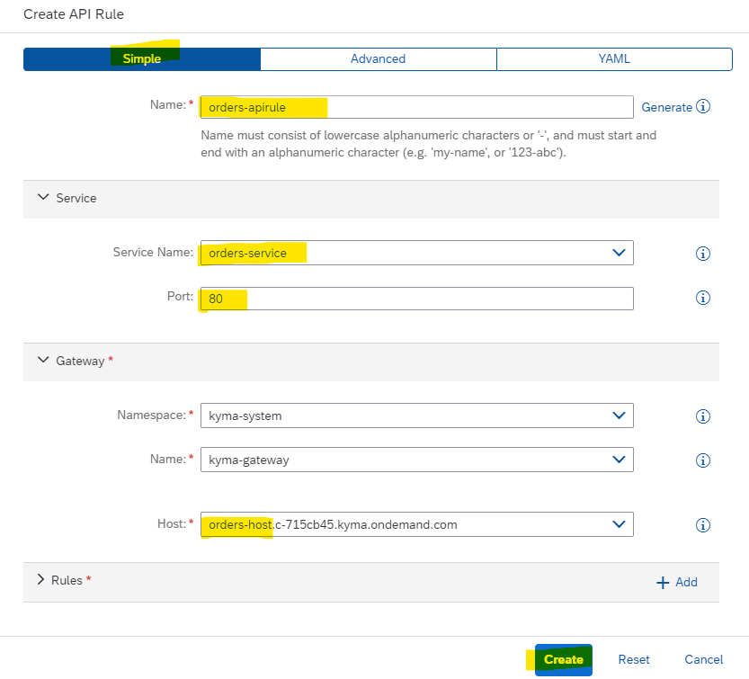
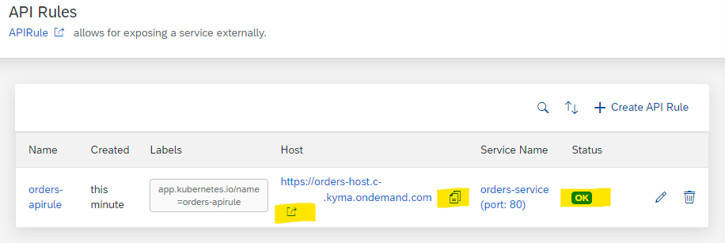

## Deploy and expose a microservice on Kyma

You already know how to deploy and expose a Function. Let's now do the same with a container microservice. We'll use the Kyma example **orders-service** for this.
The Kyma example orders-service is available [on GitHub](https://github.com/kyma-project/examples/blob/main/orders-service/README.md) and as docker image on [Google Container Registry](eu.gcr.io/kyma-project/develop/orders-service:68a58069).

<br>

### Deploy the microservice from image

1. Open your Kyma dashboard in your BTP Kyma subaccount.
2. Select your **Namespace**, for example **default**.
3. Select **Workloads --> Deployments** in the left navigation pane of your dashboard.
4. Click on button `+ Create Deployment` in the detail view.

   

5. Choose the preset **Advanced**  and provide the following parameters:

   >Name: orders-deployment <br>
   >Docker Image: eu.gcr.io/kyma-project/develop/orders-service:68a58069 <br>

   Optionally, to save resources, modify these parameters: 

   >Memory requests: 10Mi  <br>
   >Memory limits: 32Mi  <br>
   >CPU requests (m): 16m  <br>
   >CPU limits (m): 20m  <br>

   

6. Click `Create`.

7. A new deployment **orders-deployment** will be created. <br>
   The operation was successful if you can see 1/1 Pods running in the Deployment's view.
   
   


### Create the Service

Now that we have the Deployment, let's deploy the Kubernetes Service to allow other Kubernetes resources to communicate with your microservice.

1. Select **Discovery and Network --> Services** in your left-handed dashboard navigation pane
2. Click on button `+ Create Service` in the detail view.
3. In the Create Service view, paste the following values to your YAML file:

```

apiVersion: v1
kind: Service
metadata:
  name: orders-service
spec:
  selector:
    app: orders-deployment
  ports:
    - protocol: TCP
      port: 80
      targetPort: 8080

```

4. A new service, called **orders-service** will be created.


### Expose the microservice

You cannot yet access and test your new orders-service from outside the cluster. To expose the microservice, you must create an **API Rule** for it, just like when you exposed our Function.

1. In your dashboard, go to **Discovery and Network --> API Rules**.
2. Click on `+ Create API Rule`. 
3. A popup window opens. Keep the preset **Simple**
3. Provide the Name for the API rule, for example **orders-apirule**.
4. In the section "Service", Select your **orders-service** from the Service Name dropdown. <br>
   Choose the port, e.g. **80**.
5. In the section "Gateway", keep the preconfigured Namespace and Name. <br>
   Choose your host from the Host dropdown. <br>
   Replace the asterix (*) with a name for your subdomain, for exmaple **orders-host**.
6. Keep the values in section "Rules".

   

7. Click Create.
8. A new API Rule has been created. Status must be **OK**.
9. The provided link will not work, it has to be extended with the String **/orders**, because the underlying docker image, has no home page. <br>
   For example: <br>
   URL: https://orders-host.c-123456.kyma.ondemand.com/ has to become <br>
   URL: https://orders-host.c-123456.kyma.ondemand.com/orders <br>

   

10. If extend the URL correctly you can see your orders: **`[]`**. <br>
    It is empty, as you did not create orders in this tutorial so far.

Congratulations, you created and exposed your first microservice!
