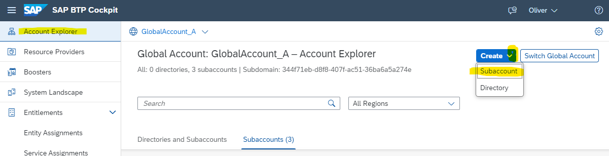
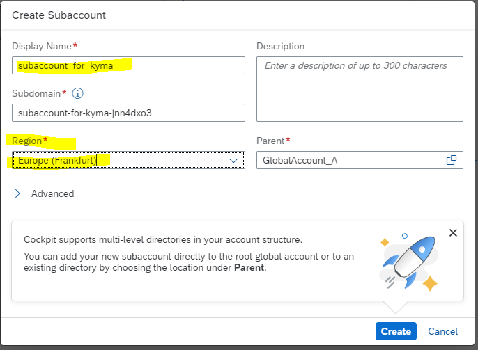
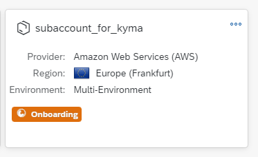
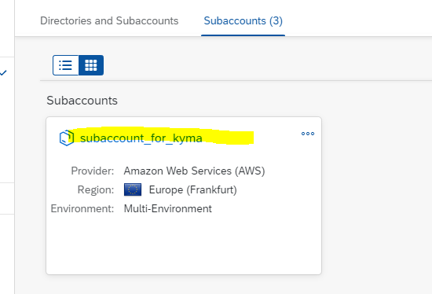
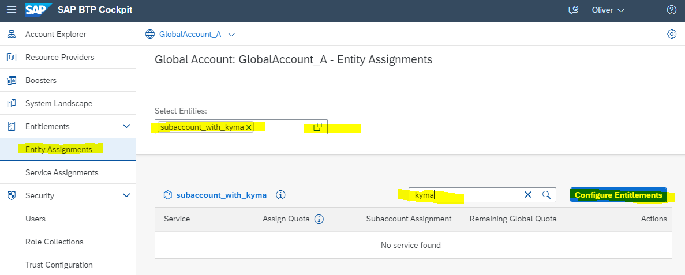
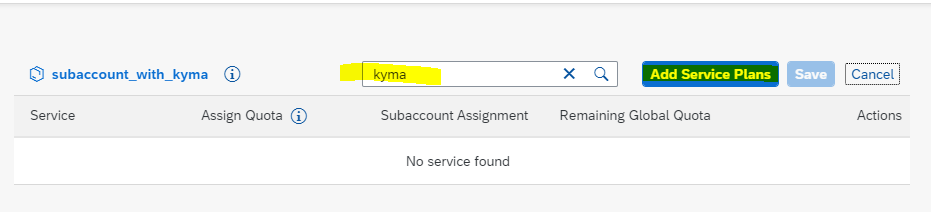
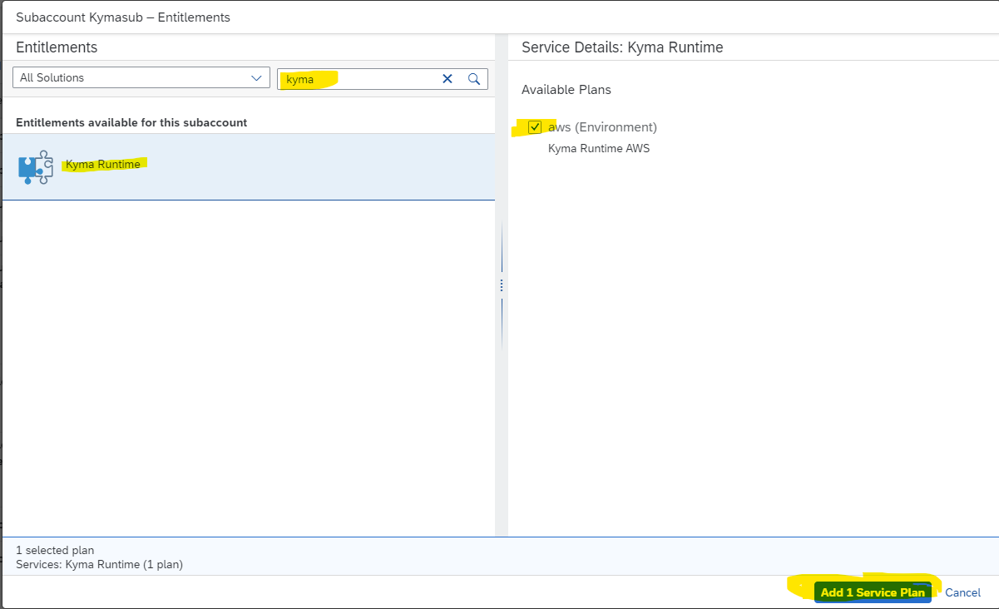
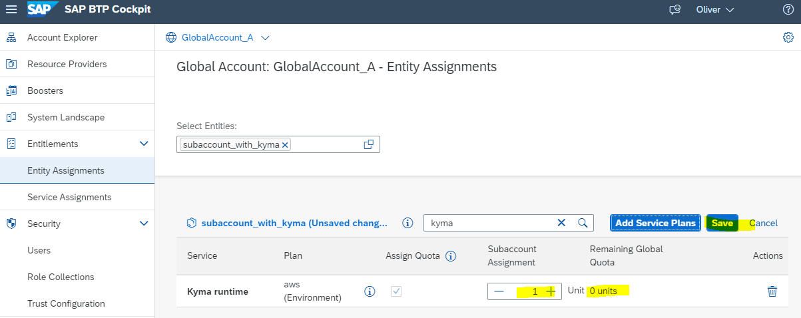
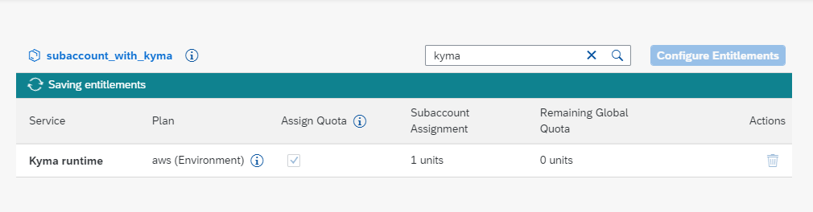
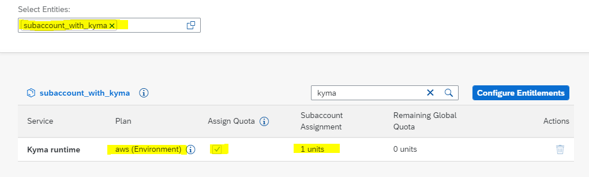

## Create a Subaccount and entitle Kyma Runtime

SAP BTP, Kyma runtime provides a fully managed Kubernetes runtime based on the open-source project "Kyma". With this cloud-native solution, developers can extend SAP solutions with serverless Functions and combine them with containerized microservices.

### Create a Subaccount

In a BTP **Enterprise Account** training environment, create a new subaccount for this tutorial.  

In a BTP **Trial Account**, a subaccount with Kyma entitlement is already preconfigured. You can create a 2nd Subaccount in Trial also, but you will not have unused entitlements for Kyma. You need to delete the Kyma entitlement in the preconfigured Subaccount first.

**Procedure**

1. Naviagte to your **Global Account Account Explorer**, quasi the home page of your GA.  
   Select **Create --> Subaccount**.
   
   

2. Prvoide a **Name** and your preferred **Region**.   
   For more details about Regions where Kyma is available, see [Discovery Center](https://discovery-center.cloud.sap/serviceCatalog/kyma-runtime?region=all).  
   You may also change the **Subdomain**, however there is no reason in thsi turorial.   
   Note: The subdomain will become part of the URL for accessing applications that you subscribe to from this subaccount. 
   The subdomain must be unique across all subaccounts in the same region. Uppercase and lowercase will not differentiate subdomains.

   

3. The Subaccount will be created.

   

4. Enter your subaccount and 

   

5. scroll down to **Entitlements**.
   The preconfigured services are shown.
   
 

### Entitle Kyma Runtime

If you use a BTP Trial Account, you are already entitled to use the **Kyma runtime** Service. 
If you use a BTP Enterprise Account, you are not yet entitled to for the **Kyma runtime** Service. 

**Procedure**

1. In your subaccount, navigate to **Entitlements --> Entity Assignments**.  
   Select Entity **YourSubaccount** of choice.  
   Put **Kyma** into the searchfield.  
   And press button **Configure Entitlements**.  

   

2. The buttons will change. Select **Add Service Plan**.

   

3. A pop-up window will come up.  
   Search for **Kyma** in "All Solutions".  
   Select **Kyma Runtime**.  
   And select your **Service Plan** of choice.   
   Press **Add 1 Service Plan**.   

   

4. Increase optionally your "Subaccount Assignment". For training keep "1".
   Press **Save**

   

5. Your entitlements will be saved.

   

6. Double-check your entitlements when done:

   

