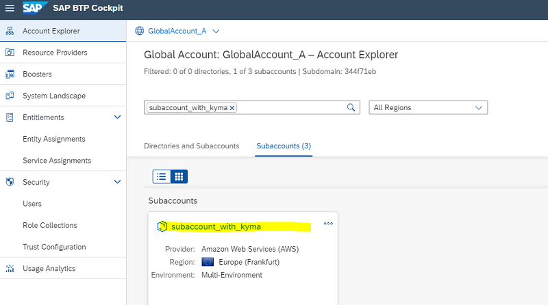
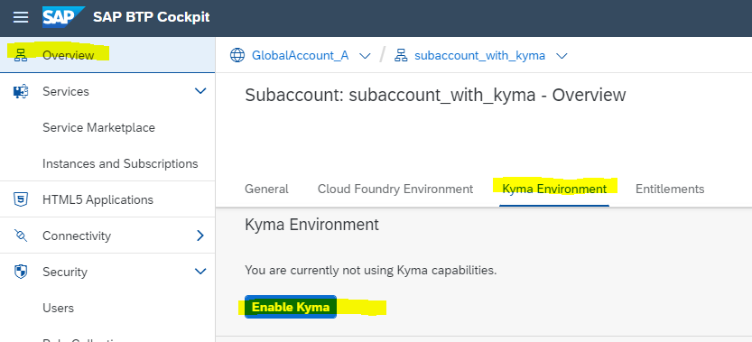
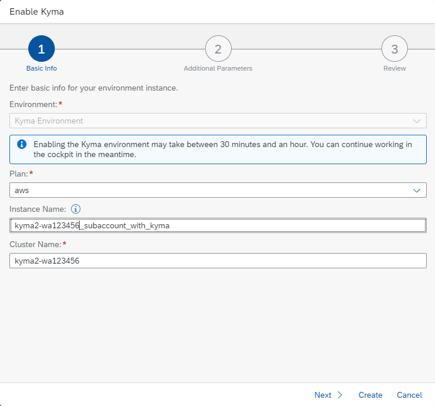
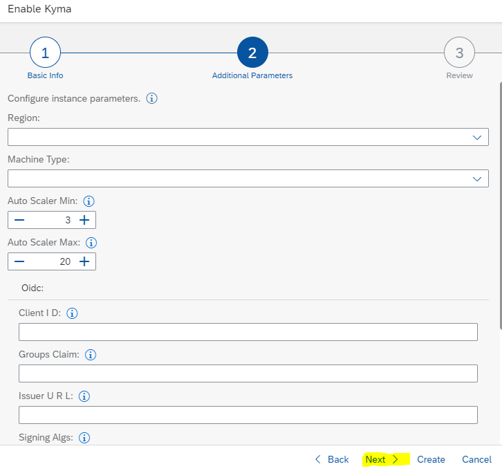
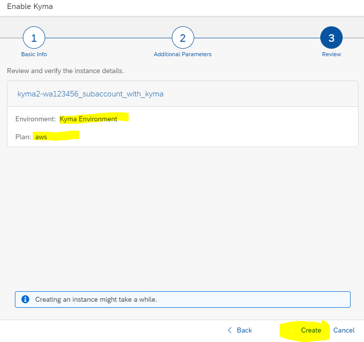
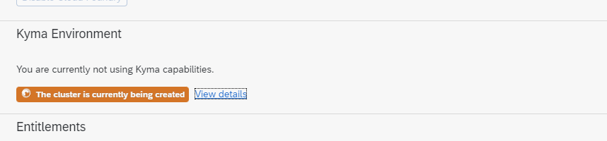
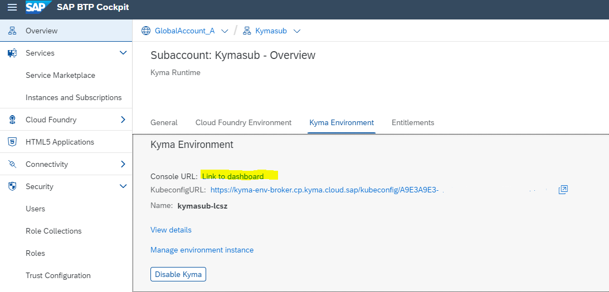
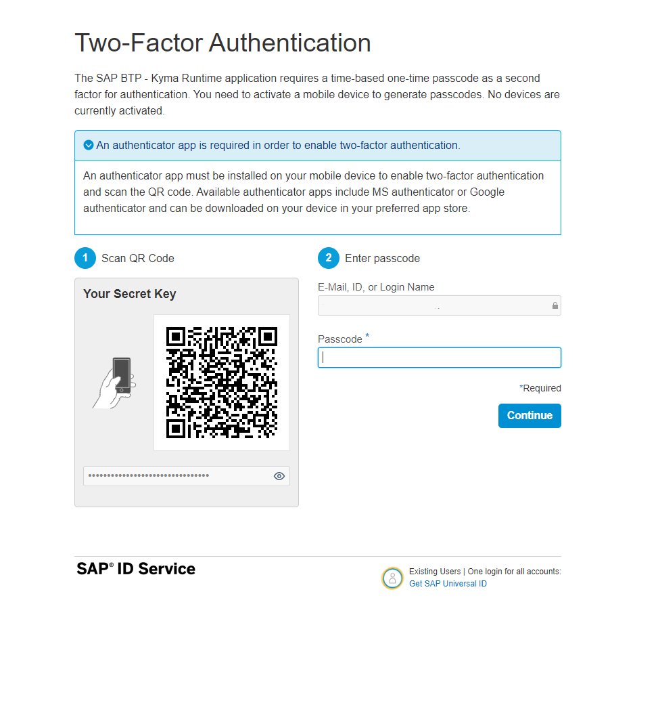
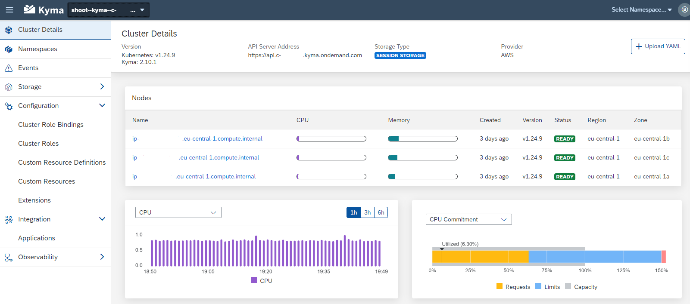

## Enable Kyma

SAP BTP, Kyma runtime provides a fully managed Kubernetes runtime based on the open-source project "Kyma". 
With this cloud-native solution, developers can extend SAP solutions with serverless Functions and combine them with containerized microservices.

As an administrator, you must perform several steps to set up a fully operational Kyma environment.

**Procedure**

1. Enter the subaccount you created for your Kyma environment.
   
   

2. In your Subaccount **Overview**, select **Kyma Environment** in your page navigation.
   Press button **Enable Kyma**

   
   
3. Wizard Step 1: In the pop-up wizard, select your **Plan**. This will define the Infarstructure Provider.
   Keep the generated Instance Name and Cluster Name   

   

4. Wizard Step 2: Simply keep the default values and leave the empty fields empty.
   
   

5. Wizard Step 3: Review the instance details.
   If everything is ok, choose **Create**

   

6. The Kyma cluster is created. This will take a while. 

   

7. Once the cluster is created you are able to enter the Kyma dashboard.
   Click Link to **Dashboard**.

   

8. If you are on the BTP "Live" landscape with your Enterprise or Trial Account and if you use the preconfigured SAP Identity Provider, 
   **2-Factor-Authentication** is enabled and will be enforced.  
   Choose your **authenticator app** of choice on your mobile phone.  
   Open the app on your mobile and press e.g. **+** to add a new **account**. Choose **Other Account** if asked.  
   Scan the **QR Code**. A password to access Kyma will be created. 
   Enter this password:
 
   

9. Congratulations, you have entered the Kyma dashboard. It should look like this:
   The tuorial will continue on the next card.
   
   
