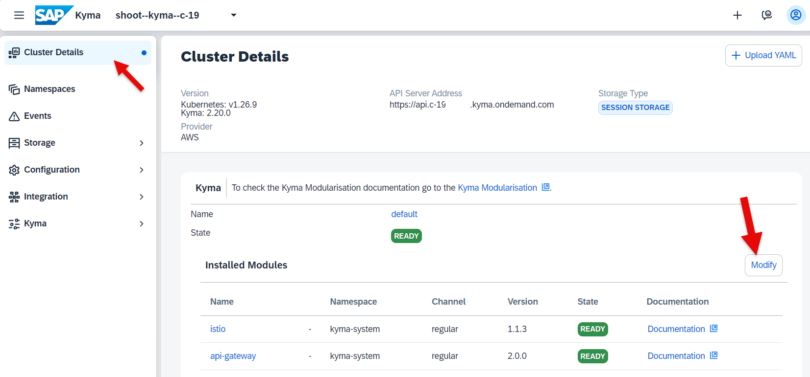
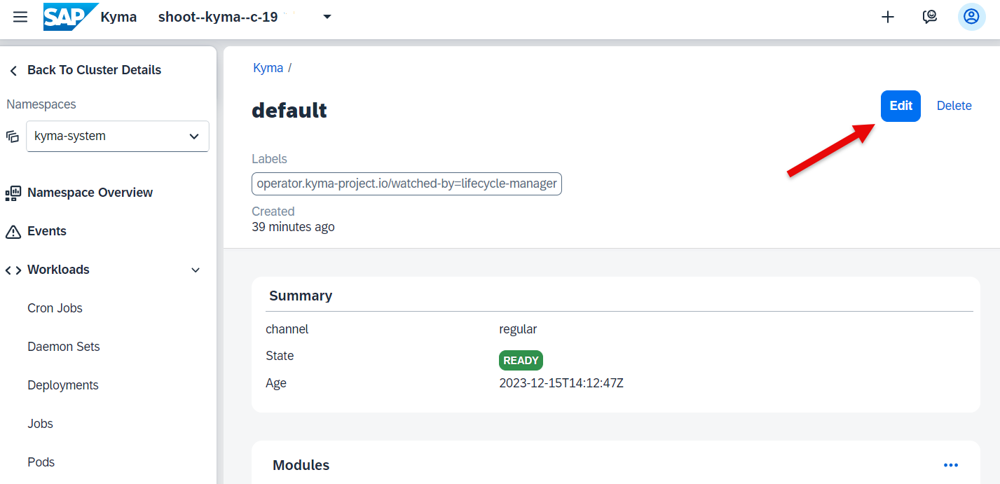
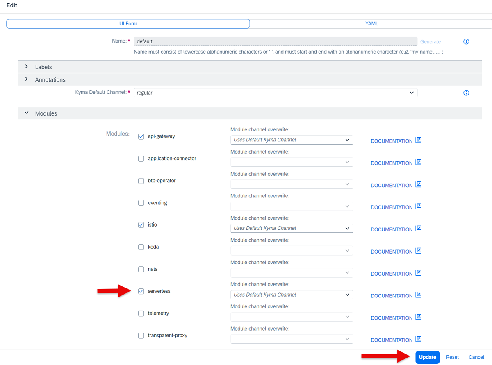
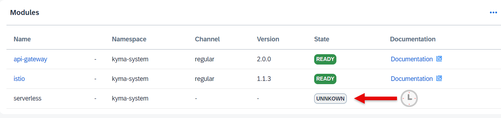
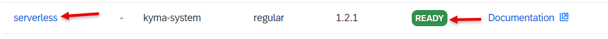
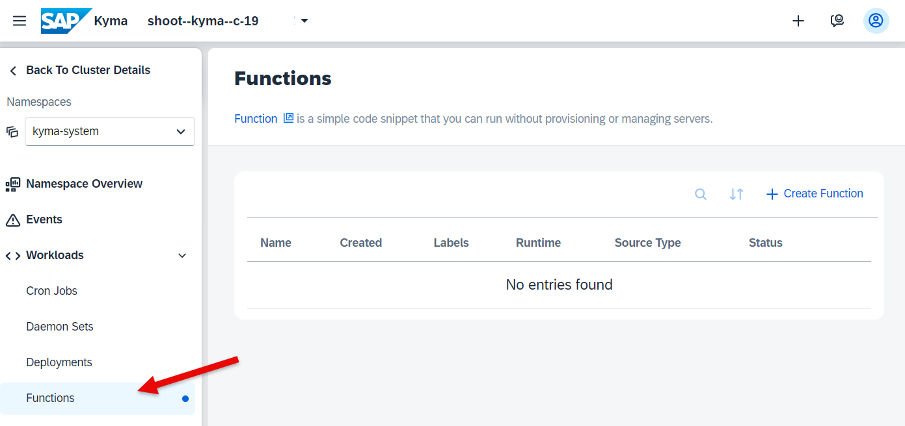

# Enable SAP BTP Kyma Modules

To use a Kyma module, you must enable it first. Use Kyma dashboard or Kyma CLI to do that. If you don't need the module anymore, disable it to save resources.

In this tutorial, you use the default release channel "regular channel". You can also choose "Fast Channel". For more information, see [Kyma Release Channels](https://help.sap.com/docs/btp/sap-business-technology-platform/kyma-s-modular-approach?locale=en-US).

If you want to enable additional modules, follow this procedure:

#### Procedure

1. In your BTP Cockpit goto your subaccount, choose Services and the Instances and Subscriptions.

2. In your Instances and Subscriptions home page, scroll down to your Environments, choose the line "Kyma Environment" and clikc on three dots `...`. Choose "Go to Dasboard". 

3. Your Kyma Dashboard opens. You are on the "Cluster Details" home page.

    Click "Modify".

    

4. You enter your "default" Kyma Namepace.

    Click on "Edit".

    

5. Add the serverless Kyma module by selecting it. You will need it, when you create a Kyma function.

    Click "Update".

    

6. The module will be added. You can see the progress in your Cluster Details home page.

    

    It takes a while to complete.

    

7. Once done, click on the serverless module.

    

    You will be forwarded to your default Namespace. The Workload "functions" is now available.

    

Congratulations! You enabled the serverless Functions in Kyma. 