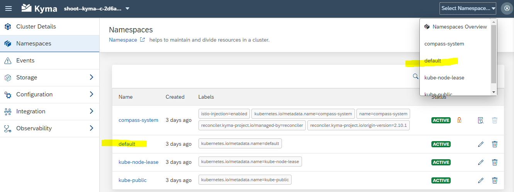
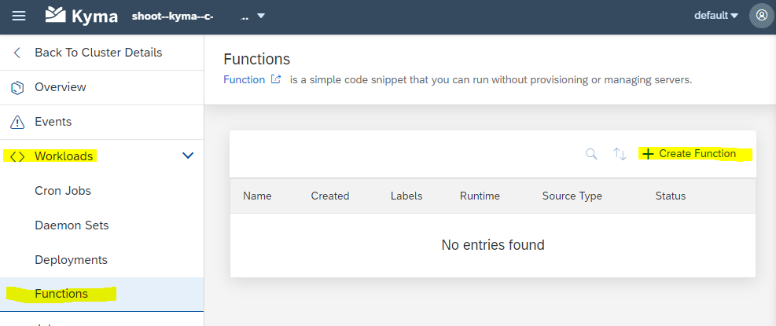
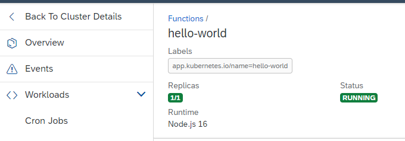
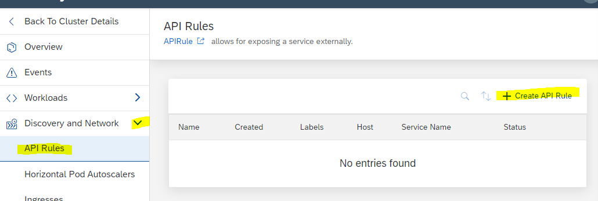
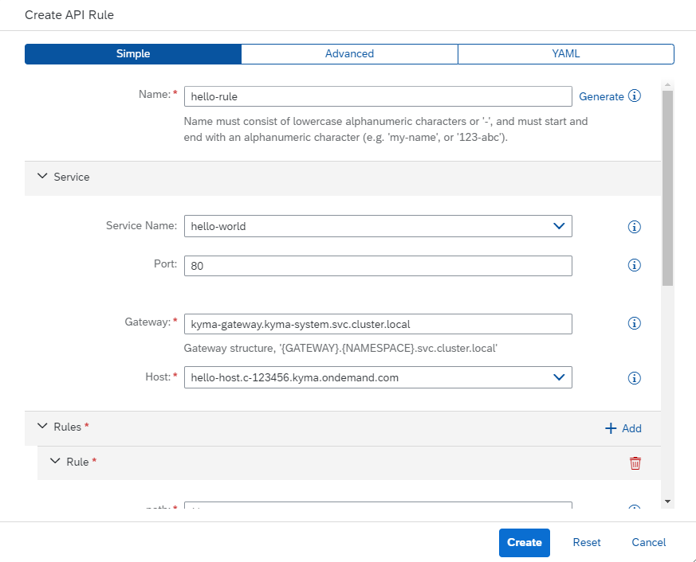
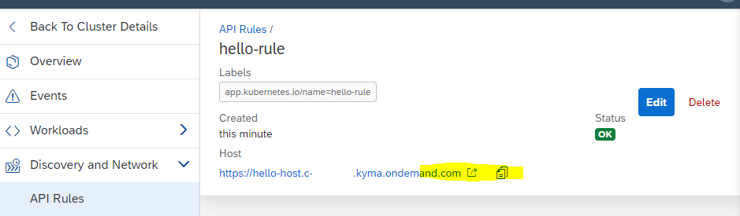
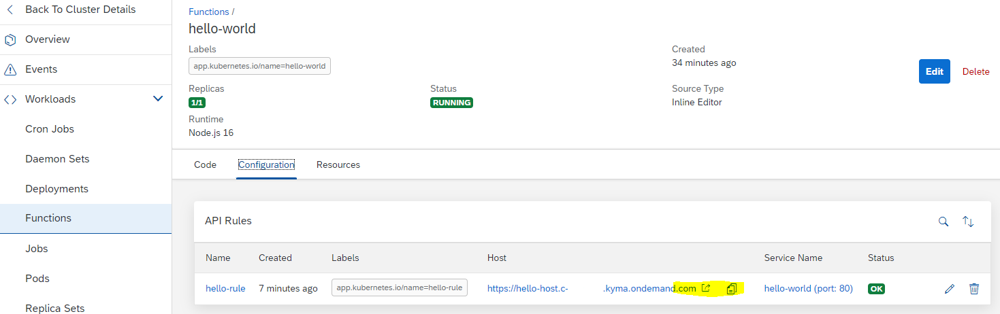

## Create a Hello-World Kyma Function

Now, as the BTP Service Kyma is entitled and enabled, you can create the first service in Kyma.
In this card, you will use Kyma Dashboard to create a Kyma function. 
The other option is to use a Command Line tool, which we will cover later in this tutorial.

You cann follow this tutorial also on Kyma Docs, [Deploy and expose a Function](https://kyma-project.io/docs/kyma/latest/02-get-started/02-deploy-expose-function/) .

**Procedure**

1. Open your Kyma Dashboard (see previous card of the tutorial).  
   Choose **Namespaces** from the left-handed navigation.  
   Choose **default** in the Namesapces list or from the drop-down list-box.  
    
   

2. In the default Namespace, select **Workloads --> Functions** and select **+ Create Function**.

   

3. The "Create Function" wizard opens. Keep the preset **Simple** 
   Provide a name, e.g. **hello-world**.  
   Choose **Language** > **nodejs**.  
   Choose your **Runtime Version** > e.g. **node.js 16**.  
   Keep the preset values. Note that a YAML file will be created under **Source**.   
   You may now also the check the other presets advanced and yaml.   
   Choose **Create**

   

4. The result is a new function **hello-world** in Kyma Functions.

   

5. Navigate to **Discovery and Network --> API Rules**.   
   Select **+ Create API Rule**.

   
   
6. Provide a name, e.g. **hello-rule**
   As Service, choose the function you just created: **hello-world**.   
   Keep the prefilled Gateway.   
   You see that the **Host** defintion is incomplete.   
   Provide a unique name for the host which is not yet in use. E.g. **hello-host**.    
   Keep the **Rules** as is.  
   Choose **Create**.
      
   

7. The API Rule "hello-rule" is created.  
   Click on the host URL to execute your funtion in a browser window.

   
   
8. A browser windows will open showing the result of the function:

   **`Hello World from the Kyma Function hello-world running on nodejs16!`**
      
9. you may also execute your funtion under **Workloads --> Functions**. Select Function "hello-world".  
   Select **Configuration**
      
   
