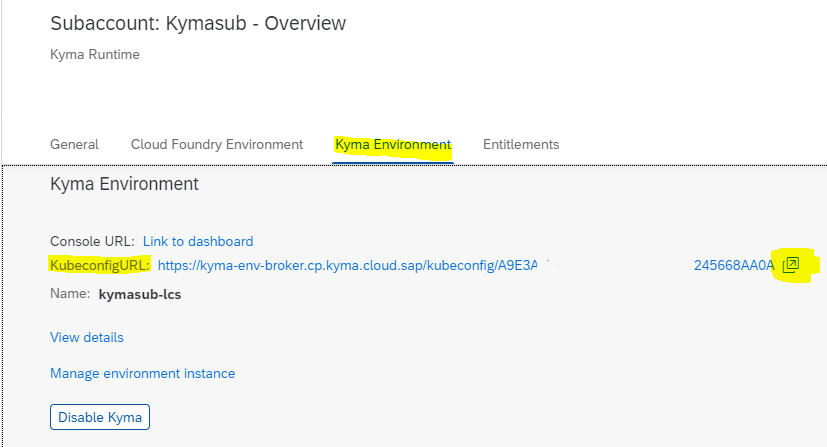
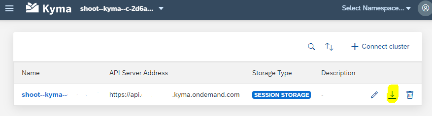

## Setup Kubectl as Command Line Tool


### Required Command Line Tools

You will need 3 command line tools in order to run this tutorial:

1. [kubectl](https://kubernetes.io/docs/tasks/tools/) 
2. [kubelogin](https://github.com/int128/kubelogin) (a kubectl plug-in)
3. [kyma CLI](https://kyma-project.io/docs/kyma/latest/04-operation-guides/operations/01-install-kyma-CLI)

**kubectl** is a Kubernetes command line tool for communicating with a Kubernetes cluster's control plane, using the Kubernetes API. <br>

**kubelogin** is a kubectl plugin for [Kubernetes OpenID Connect (OIDC) authentication](https://kubernetes.io/docs/reference/access-authn-authz/authentication/#openid-connect-tokens), also known as kubectl oidc-login. <br>
It calls a browser window for your authentication. <br>
It is required to access Kyma runtime in an interactive training environment, like you use here. <br>
It is not needed if you use a different kubernetes authentication method (not part of this tutorial).  <br>
**Note:** It has to be renamed to **kubectl-oidc_login** as shown later in this tutorial. <br>

**kyma CLI** is the command line interface of Kyma. <br>

And you will need a **kubeconfig.yaml** file. The kubectl command-line tool uses kubeconfig files to find the information it needs to choose a cluster and communicate with the API server of a cluster. You will create one later.

**Hint:** The "Get Started"-guide [Deploy and expose a Function](https://kyma-project.io/docs/kyma/latest/02-get-started/02-deploy-expose-function/) on Kyma-project.io describes the steps in more detail.

<br>

### Install the Command Line Tools

**Option 1:**
Follow the installation instructions, linked under "Required Command Line Tools".

**Option 2:**
For a training setup, you may also setup the required tools manually:

1. Download [kubectl latest release binary](https://kubernetes.io/docs/tasks/tools/install-kubectl-windows/).
2. Download [kubelogin latest release](https://github.com/int128/kubelogin/releases).
3. Download [kyma CLI latest release](https://github.com/kyma-project/cli/releases).
4. Rename `kublogin.exe` to `kubectl-oidc_login.exe`.
5. Copy the 3 files in a windows folder of your choice. E.g. `C:/tools`.
6. Add your tools folder path to your Windows environment variable `Path`  
   (either in user variables Path or system variables Path). <br>
   Hint: You can access the System Properties by searching for `environment variables` in your windows search.   <br>
7. Test your "installation". <br>
   Open a CMD or Powershell window. <br>
   Type `kubectl` and enter. The result should list the available commands for kubectl. <br>
   Type `kubectl version` to see the version. <br>
   Type `kyma` and enter. The result should list the available commands fro kyma CLI. <br>
   Type `kyma version` to see the version. <br>
   
8. Before you can test kubelogin, you have to provide additional configuration first.

<br>

### Download the Kyma runtime kubeconfig

The kubectl tool relies on a configuration file called the **kubeconfig**, to configure access to the cluster. <br>
It can be obtained from both the BTP Cockpit and the Console UI. <br>
<br>

#### Option 1: obtain the kubeconfig from the SAP BTP Cockpit

1. Within your BTP account, navigate to the sub-account which has the Kyma runtime  enabled.

2. In the subaccount choose **Overview** in the navigation pane.

3. Scroll down to the Kyma Environment details

4. Choose the link next to **KubeconfigURL** to download the kubeconfig



<br>

#### Option 2: obtain the kubeconfig from the Console UI

1. Enter the to dashboard of your Kyma runtime.

2. Log onto the Kyma runtime if required.

3. At the top-left of the Kyma runtime window you will find a drop down which displays the name of the currently connected runtime.

4. Select the drop down and choose the option Clusters Overview


5. Choose the Download Kubeconfig icon to download the file.



<br>

### Set the KUBECONFIG environment variable

Last but not least, set the KUBECONFIG environment variable.

**Procedure**

1. Open either a Command Prompt CMD or Powershell on Windows (for other operating systems, see this [blog](https://developers.sap.com/tutorials/cp-kyma-download-cli.html#75772670-a4dd-4e30-9b78-0ad810b9e28e))

2. in DOS, type set `KUBECONFIG="<KUBECONFIG_FILE_PATH>"` and Enter. <br>
   for example: **`set KUBECONFIG="C:\tools\kubeconfig.yaml"`**  <br>
   Tip: Shift+right-click the kubeconfig.yaml file to copy the path <br>

   in Powershell type `$ENV:KUBECONFIG="<KUBECONFIG_FILE_PATH>"` and Enter. <br>

3. Test your configuration by running this command

   **kubectl config get-contexts**
   
   The result shows what you just configured and should look like this:

   ```
     CURRENT   NAME                     CLUSTER                  AUTHINFO                 NAMESPACE
     *         shoot--kyma--c-2d6af59   shoot--kyma--c-2d6af59   shoot--kyma--c-2d6af59
   ```


<br>

### Verify kubelogin and your connection

Now let's verify that the installation of kubelogin was successful. 

1. Rename kubelogin to **kubectl-oidc_login** if not done so already.

2. Run:

   `kubectl get deployments -n kyma-system` .

   > A browser window will open, and you have to authenticate yourself, if you do not have active sessions. <br>
   > If this step fails, sth. went wrong with your kubelogin installation.
   > **Remember:** The authentication token is only valid for a limited time.


   The installation succeeded if all the Deployments returned are in status READY. The result could look like this:

   ```
   NAME                                         READY   UP-TO-DATE   AVAILABLE   AGE
   api-gateway                                  1/1     1            1           6d22h
   central-application-connectivity-validator   2/2     2            2           6d22h
   central-application-gateway                  2/2     2            2           6d22h
   cluster-essentials-pod-preset-webhook        2/2     2            2           6d22h
   ....
   ````

Congratulations!

<br>

### Further Information

[Access a Kyma Instance Using kubectl](https://help.sap.com/docs/btp/sap-business-technology-platform/access-kyma-instance-using-kubectl?locale=en-US)

[Kyma Environment](https://help.sap.com/docs/btp/sap-business-technology-platform/kyma-environment?locale=en-US)

https://kubernetes.io/docs/setup/  Learning environment

https://kubernetes.io/docs/tasks/tools/

https://kyma-project.io/docs/kyma/latest/02-get-started/

https://developers.sap.com/tutorials/cp-kyma-download-cli.html


