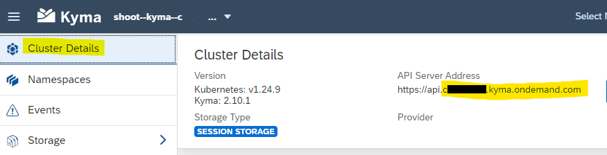

## Create a Kyma Function with Kubectl

After you have setup your Command Line Tools for Kyma, you can now access your Kyma environment and create a Function.

Before you start, you might have to establish your connection to Kyma again.
Open CMD and run <br>
`set KUBECONFIG="C:\tools\kubeconfig.yaml"`  <br>
`kubectl get deployments -n kyma-system`   <br>
again. This requires authentication in your Kyma service and gives you a valid session.


### Create a function

1. Open CMD.

2. Choose a working folder. You will create files. For example: C:\tools .

3. Create Function <br>
   In order to create a function, run:
   ```
   kyma init function --name hello-function
   ```
   command line result: <br>
   \- Project generated in C:\tools
   
   <br>

4. Apply the function to your Kyma runtime, run:
   ```
   kyma apply function
   ```
   command line result:  
   \- Configuration loaded  <br>
   \- Function - hello-function created `
   
   
   **Note:** You have now created 3 files in your working folder:
   > config.yaml <br>
   > handler.js <br>
   > package.json <br>
   
   you may check the content of the files with your editor (e.g. Visual Studio Code). It is the same as you have seen in the Kyma Dashboard UI.
  
  <br>
  
3. To verify the function deployment, run: 
   ```
   kubectl get functions hello-function
   ```
   
   the result should be: 
   ```
       NAME             CONFIGURED   BUILT   RUNNING   RUNTIME    VERSION   AGE
       hello-function   True         True    True      nodejs14   1         4m9s
   ```
<br>
   
   
### Expose the Function   

1. Note down your cluster domain name. <br>
   To expose the function for external access, you need to create an **API Rule**, as you did with the Dashboard UI. <br>
   First, note down your cluster domain.  <br>
   Unfortenately kubectl does not know his domain. But you can find it in the **Cluster Details** of your Kyma Dashboard. <br>
   Note: `https://api.` is not part of the cluster domain name!
   
   

2. Create a yaml file, which contains your API rule definition. <br>
   For example, name it `myapirule.yaml`, place it in tools folder und add the following configuration. <br>
   Replace the following values with your values: <br>
   * **name:** hello-rule2 (will be the name of the new rule. Keep it or replace it, must be unique in your cluster)
   * **host:** hello-host2 (will be the name of the new host. Keep it or replace it, must be unique in your cluster)
   * **host:** 123456789.kyma.ondemand.com (**replace it** with your cluster domain)
   * service **name:** hello-function (the name of the function you just created, you can also use another deployed function)

<br>

Example code for the `myapirule.yaml` configuration file:
```
apiVersion: gateway.kyma-project.io/v1beta1
kind: APIRule
metadata:
  name: hello-rule2
  namespace: default
spec:
  gateway: kyma-system/kyma-gateway
  host: hello-host2.123456789.kyma.ondemand.com
  rules:
    - accessStrategies:
      - config: {}
        handler: allow
      methods:
        - GET
        - POST
        - PUT
        - PATCH
        - DELETE
        - HEAD
      path: /.*
  service:
    name: hello-function
    port: 80
```

Now deploy you API Rule. Run: kubectl apply -f "<path to your config file>". <br>
for example:   

```
kubectl apply -f "C:\tools\myapirule.yaml"
```
The command line result is: <br>
apirule.gateway.kyma-project.io/hello-rule2 created

<br>   
   
### Verify the Function exposure

If you have [curl](https://curl.se/download.html) installed, run curl https://hello-world.$CLUSTER_DOMAIN  <br>
for example: `curl https://hello-host2.12345678.kyma.ondemand.com/`

If the deployment was successful, the command line result is: <br>
`Hello Serverless`
   
You can also execute the function from your Kyma Dashboard as described in the previous steps of this tutorial.   

